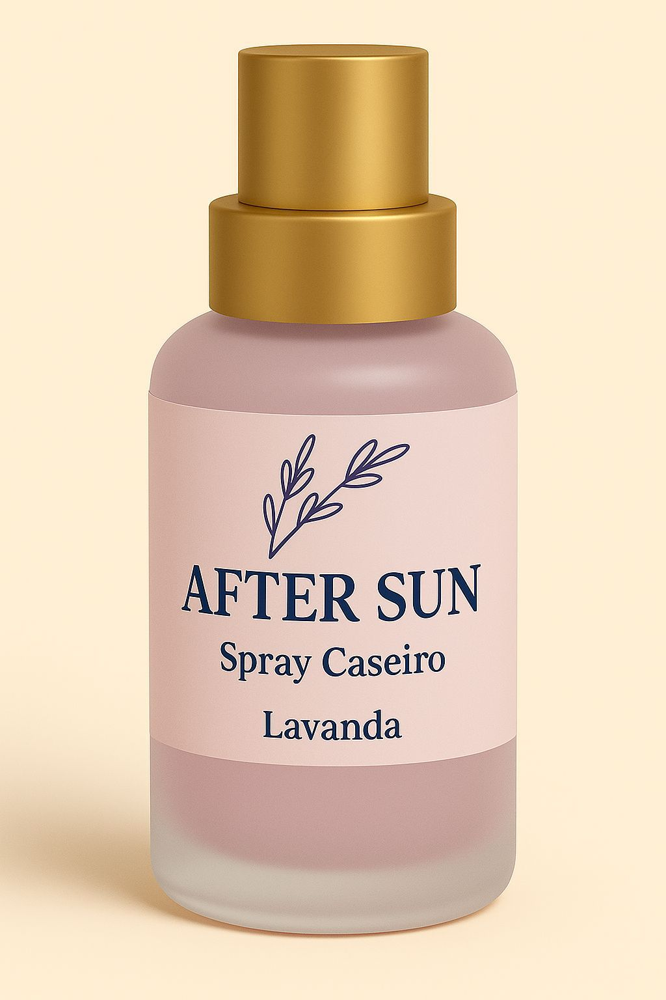
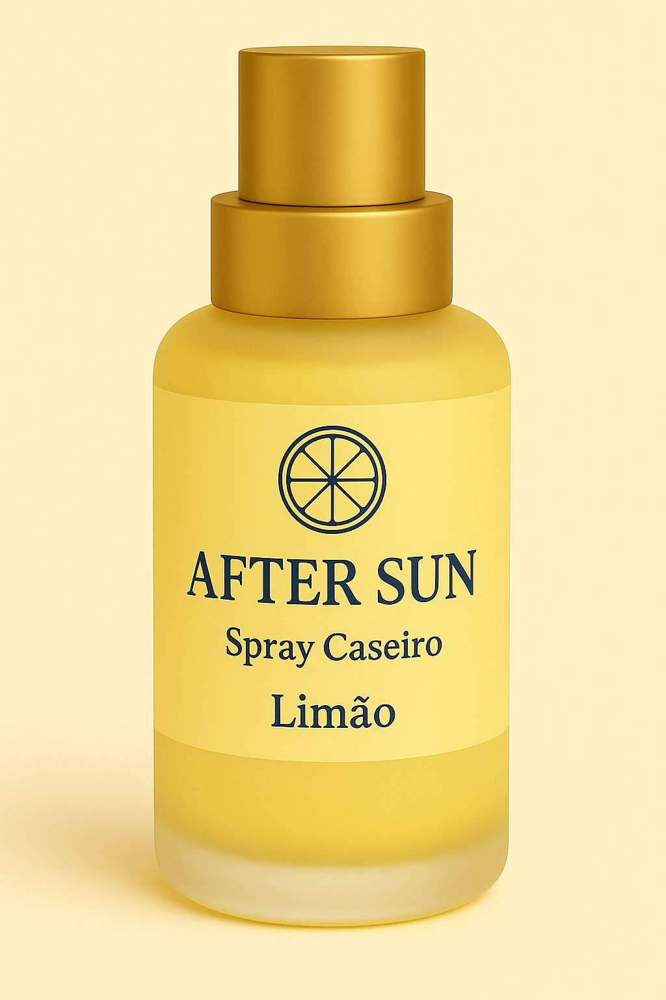
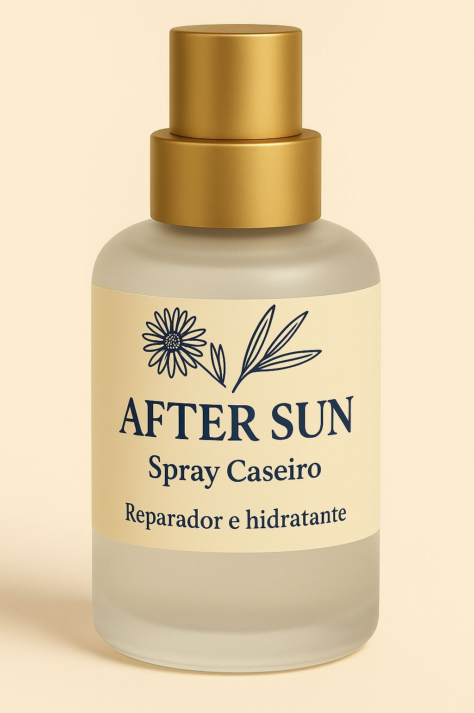
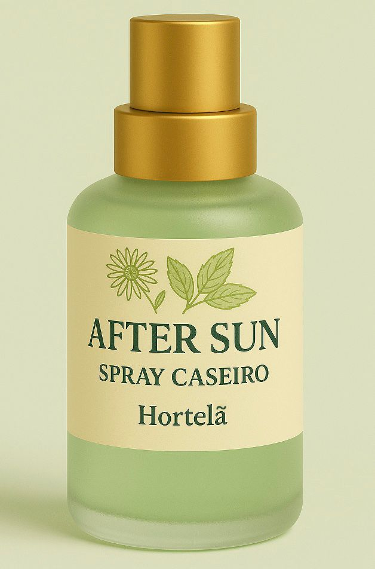
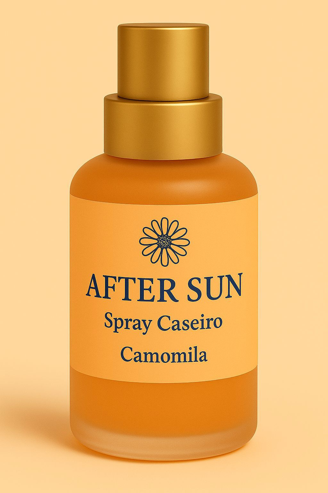

<html lang="pt">
<head>
  <meta charset="UTF-8">
  <meta name="viewport" content="width=device-width, initial-scale=1">
  <title>Solevita After Sun Spray</title>
  
</head>
<body>

<header>
  <h1>After Sun Spray Caseiro</h1>
  
Alívio natural e cuidado profundo para a tua pele após o sol

  <section id="hero-carousel">
    

      

        <h1>After Sun Natural</h1>
        <a href="#intro1" class="cta-button">Descubra os Benefícios</a>
      

    

    

        

          <h1>After Sun Natural</h1>
          <a href="#intro1" class="cta-button">Descubra os Benefícios</a>
        

      

  </section>
</header>

<section id="intro">
  <h2 class="fade-in">Sobre o Produto</h2>
  
Após um dia de exposição solar, a pele precisa de cuidados especiais para se regenerar, hidratar e recuperar o seu equilíbrio natural. O AfterSun Spray Caseiro foi desenvolvido com ingredientes 100% naturais, pensado para acalmar a vermelhidão, aliviar a sensação de ardor, prevenir a descamação e promover uma hidratação intensa.

  
Este spray refrescante atua de forma suave e eficaz, proporcionando alívio imediato e ajudando a restaurar a saúde da pele. Ideal para todos os tipos de pele, especialmente as mais sensíveis ou irritadas pelo sol.

</section>

<section id="intro1">
    <h2 class="fade-in">Benefícios principais</h2>
    <ul class="benefits-list">
      <li class="fade-in">Acalma a vermelhidão e irritação</li>
      <li class="fade-in">Previne a descamação da pele</li>
      <li class="fade-in">Hidrata profundamente</li>
      <li class="fade-in">Estimula a regeneração natural da pele</li>
      <li class="fade-in">Fórmula 100% natural e caseira, sem químicos agressivos</li>
      <li class="fade-in">Alivia a sensação de ardor</li>
    </ul>
  </on>
  

<on id="benefits" class="fade-in">
  <h2 class="fade-in">Aromas</h2>
  
     
    

      

      
      

      

      <h3 align="center">Lavanda</h3>
    

    

    

      

      
      

      

      <h3 align="center">Limão</h3>
      

    

    

        

          
        

        

          <h3 align="center">Natural</h3>
        

      
 
    

        

        
        

        

        <h3 align="center">Hortelã</h3>
      

    

    

      

      
      

      

      <h3 align="center">Camomila</h3>
    

    

  

</on>

<on id="formulacao" class="fade-in">
    <h2>Constituição do Produto</h2>
    <ul class="ingredientes-list">
      <li>Mel ou açúcar mascavado (amarelo)</li>
      <li>Chá verde</li>
      <li>Gel de aloé vera</li>
      <li>Glicerina vegetal</li>
      <li>Óleo vegetal de girassol ou azeite leve</li>
      <li>Óleo de coco fracionado</li>
      <li>Óleo essencial de hortelã, lavanda, camomila e limão</li>
    </ul>
  </on>
  

<on id="ideal-para" class="fade-in">
    <h2>Feito para quem valoriza o essencial</h2>
    

      

        
        
Um cuidado pós-solar <strong>natural e eficaz</strong>

      

      

        
        
<strong>Ingredientes simples</strong> que respeitam a tua pele

      

      

        
        
Produzido com <strong>carinho e consciência ecológica</strong>

      

    

  </on>

  <on id="cta-compra">
    <h2 class="fade-in">Dá à tua pele o carinho que ela merece</h2>
    
Descobre o poder do AfterSun Spray Caseiro — o teu aliado natural nos dias de sol!

    <a href="javascript:void(0)" onclick="abrirModal()" class="cta-button fade-in">Quero experimentar</a>
  </on>

  

    

      &times;
      <h2>Fala connosco</h2>
      
Envia-nos uma mensagem e entraremos em contacto contigo o mais breve possível.

      <form>
        <input type="text" placeholder="O teu nome" required>
        <input type="email" placeholder="O teu e-mail" required>
        <textarea placeholder="A tua mensagem" rows="4" required></textarea>
        <button type="submit">Enviar</button>
      </form>
    

  

  
  
    

<on id="faq" class="fade-in">
  <h2 class="fade-in">Perguntas Frequentes</h2>
  

    
Como usar?

    
Agite bem antes de usar. Aplica diretamente na pele limpa após a exposição solar, deixando absorver naturalmente. Pode ser usado sempre que necessário ao longo do dia.

  

  

    
É indicado para todos os tipos de pele?

    
Sim, é ideal para todos os tipos de pele, especialmente as mais sensíveis ou irritadas pelo sol.

  

  

    
Pode ser usado por crianças?

    
Sim, mas sempre sob supervisão de um adulto e evitando o contato com olhos.

  

</on>

<button id="scrollToTopBtn" title="Voltar ao topo">↑</button>

    

  

  

  

</body>
</html>
